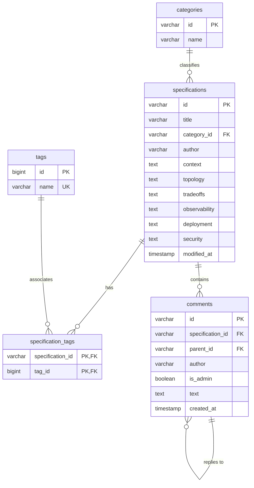

# Centralized Supabase Integration Guide

This guide describes how to migrate the SYSTEMPRO architecture specifications storage layer from a local browser IndexedDB to a centralized Supabase PostgreSQL database.

---

## 1. Database Schema Design (Normalized Tables)

SYSTEMPRO uses a normalized database structure to eliminate duplicate tags, separate core text specs, optimize retrieval paths, and store raw markdown contents.

### Entity-Relationship Diagram:


---

## 2. Supabase Database Configuration (DDL Script)

Copy and execute the following SQL DDL query script in the **SQL Editor** of your Supabase dashboard to create the tables, foreign keys, indexes, and initial categorization seeds:

```sql
-- 1. Create Categories Table
CREATE TABLE categories (
    id VARCHAR(50) PRIMARY KEY,
    name VARCHAR(100) NOT NULL
);

-- Seed Categories
INSERT INTO categories (id, name) VALUES
('distributed', 'Distributed Infrastructure Design'),
('storage', 'Distributed Storage & Cache Systems'),
('telemetry', 'High-Throughput Telemetry & Observability'),
('compute', 'Elastic Compute & Control Planes')
ON CONFLICT (id) DO NOTHING;

-- 2. Create Specifications Table
CREATE TABLE specifications (
    id VARCHAR(50) PRIMARY KEY,
    title VARCHAR(255) NOT NULL,
    category_id VARCHAR(50) REFERENCES categories(id) ON DELETE SET NULL,
    author VARCHAR(100) DEFAULT 'ADMIN',
    context TEXT,
    topology TEXT,
    tradeoffs TEXT,
    observability TEXT,
    deployment TEXT,
    security TEXT,
    modified_at TIMESTAMPTZ DEFAULT NOW()
);

-- 3. Create Tags Table
CREATE TABLE tags (
    id GENERATED ALWAYS AS IDENTITY PRIMARY KEY,
    name VARCHAR(100) UNIQUE NOT NULL
);

-- 4. Create Specification Tags Junction Table (Many-to-Many Relation)
CREATE TABLE specification_tags (
    specification_id VARCHAR(50) REFERENCES specifications(id) ON DELETE CASCADE,
    tag_id BIGINT REFERENCES tags(id) ON DELETE CASCADE,
    PRIMARY KEY (specification_id, tag_id)
);

-- 5. Create Comments Table (Self-referential recursive structure)
CREATE TABLE comments (
    id VARCHAR(100) PRIMARY KEY,
    specification_id VARCHAR(50) REFERENCES specifications(id) ON DELETE CASCADE,
    parent_id VARCHAR(100) REFERENCES comments(id) ON DELETE CASCADE,
    author VARCHAR(100) NOT NULL,
    is_admin BOOLEAN DEFAULT FALSE,
    text TEXT NOT NULL,
    created_at TIMESTAMPTZ DEFAULT NOW()
);

-- 6. Optimization Indexes
CREATE INDEX idx_specs_category ON specifications(category_id);
CREATE INDEX idx_comments_spec ON comments(specification_id);
CREATE INDEX idx_comments_parent ON comments(parent_id);
CREATE INDEX idx_spectags_tag ON specification_tags(tag_id);
```

---

## 3. Configuring Application Credentials

To establish connection connectivity with the database:
1.  In your Supabase project dashboard, navigate to **Project Settings** > **API**.
2.  Locate your project credentials:
    *   **Project URL** (e.g. `https://xxxxxx.supabase.co`)
    *   **Anon Public API Key** (e.g. `eyJhbGciOiJIUzI1NiIsInR5cCI6IkpXVCJ9...`)
3.  Open the file [index.html](file:///home/hash/sp/index.html) in your workspace code editor.
4.  Replace the empty quotes inside the configuration script block near line 214 with your project credentials:
    ```javascript
    // Supabase centralized connection credentials
    window.SUPABASE_URL = "https://your-project-id.supabase.co";
    window.SUPABASE_ANON_KEY = "your-public-anon-key";
    ```
5.  Save the changes. The application will automatically detect these credentials on boot, initialize connection verification, and use Supabase as the primary storage module instead of the local IndexedDB fallback engine.

---

## 4. Row Level Security (RLS) Setup (Security Isolation)

To secure write permissions and prevent guest write mutations in a production environment:

1.  Enable Row Level Security (RLS) on all tables in Supabase:
    ```sql
    ALTER TABLE categories ENABLE ROW LEVEL SECURITY;
    ALTER TABLE specifications ENABLE ROW LEVEL SECURITY;
    ALTER TABLE tags ENABLE ROW LEVEL SECURITY;
    ALTER TABLE specification_tags ENABLE ROW LEVEL SECURITY;
    ALTER TABLE comments ENABLE ROW LEVEL SECURITY;
    ```
2.  Define access policies for public reading:
    ```sql
    -- Allow Read Access for Everyone on all tables
    CREATE POLICY "Public Read Specifications" ON specifications FOR SELECT USING (true);
    CREATE POLICY "Public Read Categories" ON categories FOR SELECT USING (true);
    CREATE POLICY "Public Read Tags" ON tags FOR SELECT USING (true);
    CREATE POLICY "Public Read SpecTags" ON specification_tags FOR SELECT USING (true);
    CREATE POLICY "Public Read Comments" ON comments FOR SELECT USING (true);
    ```
3.  Define write mutations access policies (e.g. restrict write actions to authenticated admin accounts):
    ```sql
    -- Example Admin Policy (Allow all actions to Authenticated Users)
    CREATE POLICY "Admin Full Access" ON specifications TO authenticated USING (true) WITH CHECK (true);
    CREATE POLICY "Admin Tags Access" ON tags TO authenticated USING (true) WITH CHECK (true);
    CREATE POLICY "Admin SpecTags Access" ON specification_tags TO authenticated USING (true) WITH CHECK (true);
    ```
    *Note: If you run a fully serverless public board where all users can post comments or specifications without logging in via standard Supabase Auth, you can write policies allowing public insert/update permissions, or write custom service-level tokens.*
